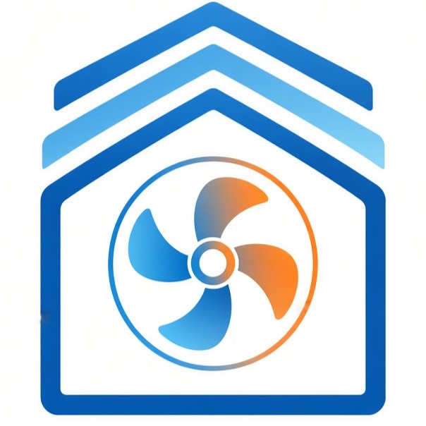
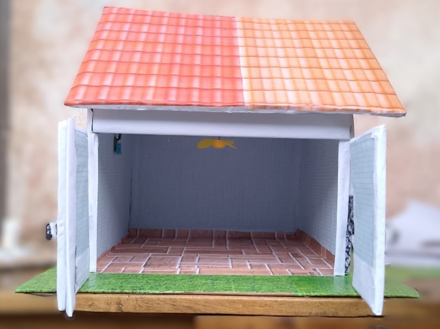
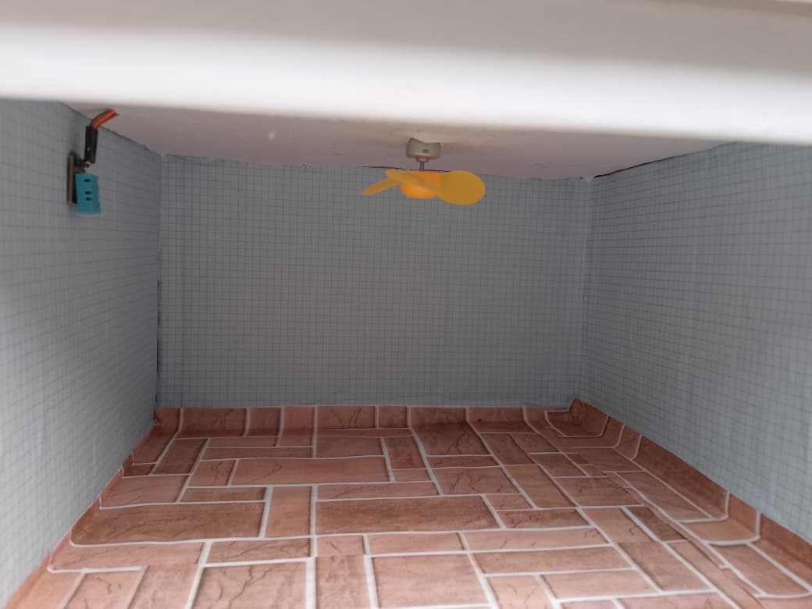

  
    
  <h1>🌡️ THERMOCONTROL BT</h1>
  <h3>Régulateur Thermique Connecté & Ventilation Intelligente</h3>
  

    <strong>Supervision continue de température ambiante et pilotage dynamique de ventilation via Bluetooth HC-05 et Arduino</strong>
  

  

    
    
    
    
    
  

 

## 📖 Présentation du Système

**ThermoControl BT** est une solution domotique connectée assurant la régulation thermique autonome et le contrôle forcé de la ventilation au sein d'enceintes fermées (habitations, locaux techniques, serres agricoles, baies serveurs).

Basé sur une unité de traitement **Arduino Uno**, une sonde thermo-hygrométrique **DHT11**, une passerelle sans fil **Bluetooth HC-05** et un module **relais 1 canal**, le système surveille la température en direct et déclenche la ventilation dès franchissement du seuil critique paramétré, tout en permettant à l'utilisateur de forcer la commande manuelle depuis son smartphone.

---

## ✨ Fonctionnalités Majeures

* 📊 **Supervision en temps réel** : Acquisition continue et émission série chaque seconde de la température vers le smartphone.
* 🤖 **Régulation Automatique par Seuil (`M1`)** : Déclenchement autonome du ventilateur si $T > T_{seuil}$ (seuil initial : 31.0°C, modifiable dynamiquement).
* 🕹️ **Pilotage Manuel Prioritaire (`M0`)** : Commandes tactiles instantanées d'allumage (`A`) et d'extinction (`B`).
* 📡 **Liaison Sans Fil Directe** : Communication Bluetooth SPP 9600 bauds totalement indépendante d'un réseau Wi-Fi ou Internet.
* 🔒 **Isolation Galvanique** : Commutation de puissance isolée par relais optocouplé protégeant l'étage logique 5V.

---

## 🛠️ Nomenclature Matérielle (BOM)

| Matériel | Rôle & Utilité dans le Système | Spécification |
| :--- | :--- | :--- |
| **Arduino Uno** | Traitement des données, boucle temporelle `millis()` et commande relais | ATmega328P, 16 MHz |
| **Capteur DHT11** | Mesure précise de la température ambiante | Signal numérique 1-fil |
| **Module HC-05** | Transmission et réception série Bluetooth bidirectionnelle | UART SPP 9600 bauds |
| **Module Relais 1 Canal** | Isole et commute l'alimentation du ventilateur | 5V DC, contact sec NO/NC |
| **Ventilateur (Moteur CC + Hélice)** | Évacuation de la chaleur et circulation d'air forcé | 5V / 12V DC |
| **Plaque d'essai (Breadboard)** | Prototypage rapide sans soudure | Standard 830 points |
| **Fils Jumpers** | Connexions électriques | Mâle-Mâle / Mâle-Femelle |

---

## 🔌 Câblage & Pinout

| Composant | Broche | Broche Arduino Uno | Description |
| :--- | :--- | :--- | :--- |
| **DHT11** | DATA | `Pin 2` | Signal numérique de température |
| **DHT11** | VCC / GND | `5V` / `GND` | Alimentation capteur |
| **HC-05** | TXD | `Pin 10` (RX) | Réception série logicielle |
| **HC-05** | RXD | `Pin 11` (TX) | Transmission série logicielle |
| **HC-05** | VCC / GND | `5V` / `GND` | Alimentation Bluetooth |
| **Relais 1 Canal** | IN | `Pin 3` | Signal de déclenchement (Actif LOW) |
| **Relais 1 Canal** | VCC / GND | `5V` / `GND` | Alimentation bobine |

---

## 📸 Galerie du Projet

  <table border="0">
    <tr>
      <td align="center">
        
          
        <strong>Vue extérieure de la maquette</strong>
      </td>
      <td align="center">
        
          
        <strong>Vue intérieure & intégration technique</strong>
      </td>
    </tr>
  </table>

---

## 👥 Équipe de Conception & Réalisation

Projet conçu et réalisé par l'équipe **Groupe n°5 — Smart Innovators** :
* 👤 **FADONOUGBO Anselme**
* 👤 **HOUNKOKOE Trifène**
* 👤 **KINDOMISSI Achille**

* **Supervision & Écosystème** : 
  * 🏫 **Centre de formation Max_Adis** (Édition 2026 — Vague 1)
  * 📍 Porto-Novo, Bénin

---

## 📄 Licence

Distribué sous licence MIT. Libre pour usage pédagogique et développement continu.
